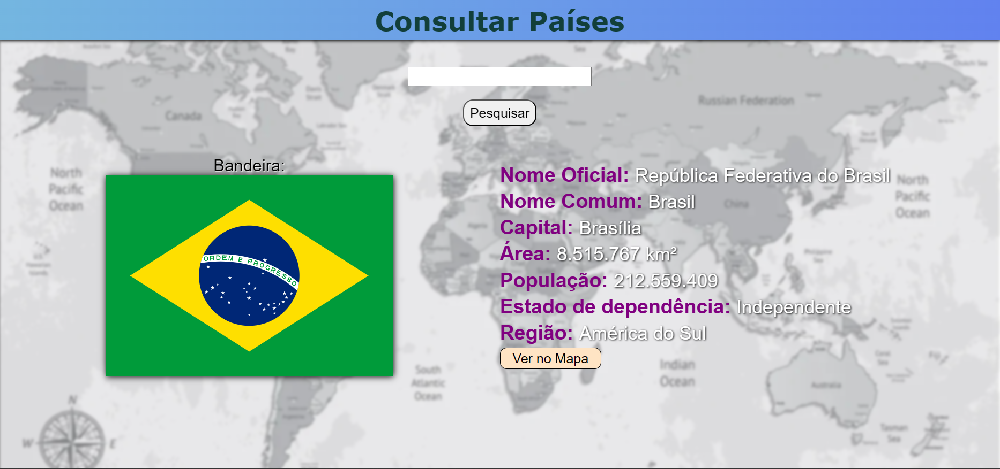

# PaisesPHP
Um website de consulta de informações sobre países mostrando sua bandeira, nome oficial, nome comum, capital, área em km², população, estado de depência e região  
Acesse o [Site](https://consultapaises.vercel.app/) em https://consultapaises.vercel.app/

## 🛠️ Ferramentas e tecnologias
O website foi programado em **PHP** utilizando a API pública [REST Countries](https://restcountries.com/)

    |  |
    |:---:|

